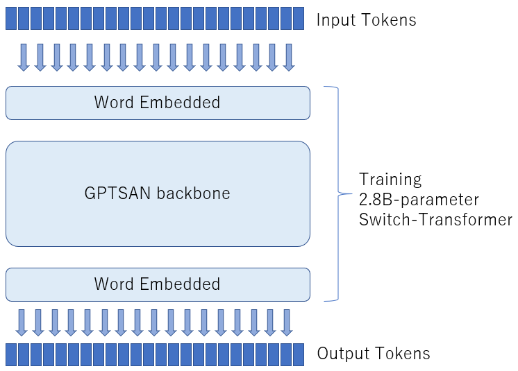
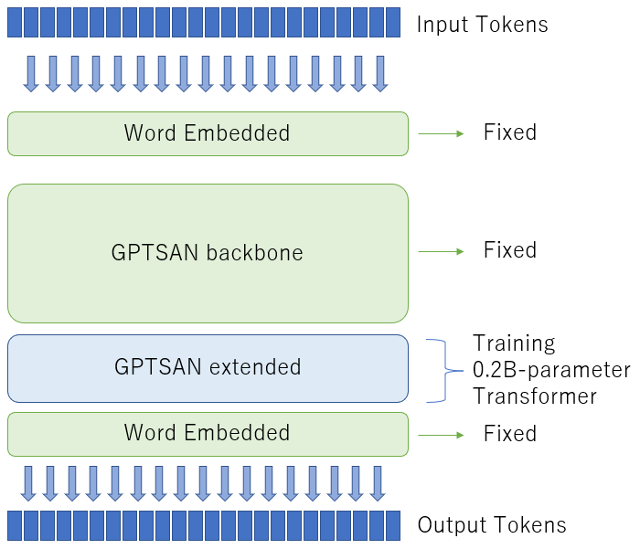
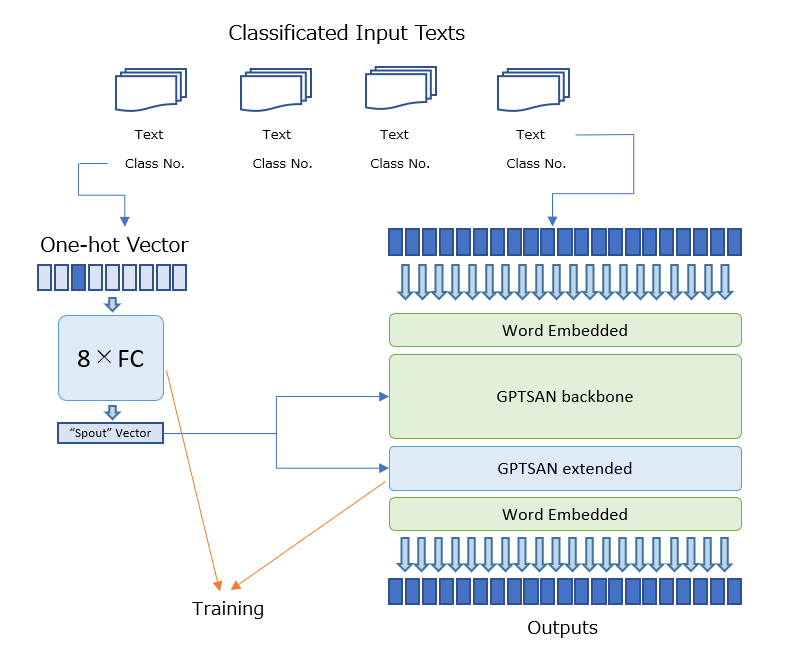

# GPTSAN Finetune

# 事前学習とファインチューニング

GPTSANでは、パラメーター数2.8BのSwich-Transformerに、小規模な追加のTransformer層（extended）を追加して、追加した層だけを学習することが出来ます。

パラメーター数2.8BのSwich-Transformerは、学習にTPUが必要になりますが、追加した層だけを学習するのであれば、1-GPUでも可能です。

事前学習した段階では、全ての層がSwitch-Transformerからなるモデルです。



ここに、Transformer層を追加します。14層追加すると全体のパラメーター数が3Bになります。



そして、追加した層だけを学習させます。

## モデルの変換

新しい層を追加するには、事前学習済みのモデルファイルから、新しい層を追加した新しいモデルファイルを作成します。

そのためには、[tools/](../tools/)にあるファインチューニング用のモデル構造の変換プログラムを使用します。

```sh
$ python run_modelconvert.py --checkpoint ../GPTSAN-2.8B-spout_is_uniform --output ../GPTSAN-finetune-3B --add_extra_stage 14
```

## テキストのエンコード

テキストのエンコードは事前に[tools/](../tools/)にある「make_tfrecord_simple.py」を実行することで、tfrecordファイルを作成します。

エンコードの際には、学習するモデルのモードを指定することが出来ます。詳しくは[モデルの種類について](model.md)を参照してください。

## ファインチューニングの実行

新しい層だけを学習させるには、学習させない層の名前を記載したJSONを「--ignore_parameters」に指定して、「run_training.py」を実行します。

学習させない層の名前は、モデルファイルのディレクトリ内に「ignore-params.json」という名前で保存されます。

学習時には、学習パラメーターのJSONを指定します。

学習パラメーターのJSONはモデルの保存ディレクトリ内にある「parameters.json」を編集して使用します。重要なのは、「output_dir」にモデルの保存場所を指定することです。この場所にあるモデルを事前学習済みモデルとして読み込んで、同じ場所にチェックポイントを保存します。

```sh
$ vi GPTSAN-finetune-3B/parameters.json
{"train_params": {"output_dir": "GPTSAN-finetune-3B", ・・・
$ python run_training.py --input_files '*.tfrecord' --ignore_parameters GPTSAN-finetune-3B/ignore-params.json --parameter_file GPTSAN-finetune-3B/parameters.json
```

[TPUによる学習](#tpu)と[GPUによる学習](#gpu)の項も参照してください。

# sqout

「sqout」は、GPTSANオリジナルの入力値です。

ファインチューニング時に、入力テキストの種類を表す値を、Transformerの内部ステータスへと追加してやることが出来ます。

クラス分類がされているテキストについて、そのクラスをベクトル空間へと投写し、文章生成時には生成したい文章のクラスを「sqout」値として指定します。



ベクトル空間への投写は、8層の全結合層で行われます。投写を行う全結合層もファインチューニング時には学習対象になります。

## クラス分けされた文章を学習

クラス分けされた文章を学習するには、文章をエンコードしてtfrecordファイルを作成する段階で、クラスをtfrecordに入れます。

それには、文章のファイル名とクラス番号が含まれているCSVファイルを、「make_tfrecord_simple.py」の入力にします。

```sh
$ cat list.csv
filename,fileid
data/A.txt,0
data/B.txt,1
data/C.txt,1
data/D.txt,2
・・・
$ python make_tfrecord_simple.py --input_files list.csv --mode lm
```

### ベースモデルの作成

投写のための全結合層が増えるので、パラメーター数を調整します。追加の層を減らすことで、GPUメモリの負担を減らします。

```sh
$ python run_modelconvert.py --checkpoint ../GPTSAN-2.8B-spout_is_uniform --output ../GPTSAN-2.81B-spout_is_onehot --add_extra_stage 2
```

必要であればパラメーターファイルを編集し、バッチサイズも変更します。[GPUによる学習](#gpu)の項も参照してください。

### spout_vectorを学習

そして、学習の際に「--spout_vector」引数に「onehot」を指定します。

```sh
$ python run_training.py --input_files '*.tfrecord' --ignore_parameters GPTSAN-2.81B-spout_is_onehot/ignore-params.json --parameter_file GPTSAN-2.81B-spout_is_onehot/parameters.json --spout_vector onehot
```

すると、クラス番号のone-hotベクトルを、「sqout」入力とする学習が実行されます。

## 生成する文章クラスを指定

文章生成時には、「--spout」オプションで数値を指定すると、その数値のone-hotベクトルを「sqout」入力として文章生成が実行されます。

```sh
$ python run_generate.py --model GPTSAN-3B-sqout-is-classifier --spout 12
```

# TPU

TPUを使った学習には、エンコードしたtfrecordファイルを、Google Cloud Storageのバケット上に配置する必要があります。

また、ファインチューニング用に読み込む事前学習済みのモデルも、Google Cloud Storageのバケット上に配置する必要があります。

その上で、パラメーターファイルの中の、「output_dir」も、Google Cloud Storageのバケット上に配置したモデルの場所に変更します。


```sh
$ vi GPTSAN-finetune-3B/parameters.json
{"train_params": {"output_dir": "gs://my-backet/GPTSAN-finetune-3B/", ・・・
$ gsutil cp -r GPTSAN-finetune-3B/ gs://my-backet/
```

そして、「--tpu_nodes」にTPUノード名を指定して、学習を実行します。TPU上では「--use_bfloat16」オプションで、bfloat16によるMixedPrecisionTrainingが可能です。

```sh
$ python run_training.py --input_files 'gs://my-backet/*.tfrecord' --ignore_parameters GPTSAN-finetune-3B/ignore-params.json --parameter_file GPTSAN-finetune-3B/parameters.json --tpu_nodes node1 --use_bfloat16
```

GCPのサービスアカウントに、TPUのアカウントがあるので、事前にバケットへのアクセス権を設定しておく必要があります。それには[Google Cloud TPUのドキュメント](https://cloud.google.com/tpu/docs/)を参考に、アクセス権限のIAMを作成します。

# GPU

追加した層の数を調整して、GPUメモリに乗るようにすれば、1-GPUのみ搭載しているマシン上でも、ファインチューニングを行うことが出来ます。

GPU上での学習に際しては、GPUメモリが制限要素となるので、パラメーターファイルの中の「batch_size」を小さく設定して、1バッチが1GPUに乗るようにします。

さらに、「num_pallarelizm」を学習に使用するGPUの数に設定します。

```sh
$ vi GPTSAN-finetune-3B/parameters.json
{"train_params": {"output_dir": "GPTSAN-2.8B-spout_is_uniform", "batch_size": 1, ・・・
"num_pallarelizm":1
```

GPU上では「--use_mixed_precision」オプションで、float16とGradientScalingによるMixedPrecisionTrainingが可能です。ただし発散しがちです。

```sh
$ python run_training.py --input_files '*.tfrecord' --ignore_parameters GPTSAN-finetune-3B/ignore-params.json --parameter_file GPTSAN-finetune-3B/parameters.json --use_mixed_precision
```
